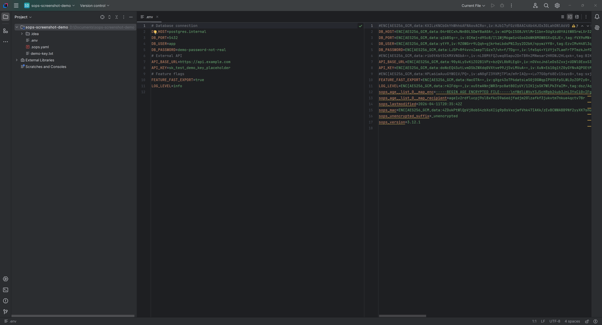

# SOPS Editor for JetBrains IDEs

Edit [SOPS](https://github.com/getsops/sops)-encrypted files directly in your IDE. The plugin opens a split view with the decrypted content on one side and the raw ciphertext on the other, and re-encrypts the file when you save.



## Features

- Split-view editor with the decrypted content on the left and the encrypted content on the right
- Re-encrypt automatically on save (toggle in settings)
- Supports `.env`, YAML, JSON, INI, TOML and binary files (same list as the `sops` CLI itself)
- Context menu actions for Encrypt, Decrypt and New SOPS Encrypted File, plus `Ctrl+Alt+E` and `Ctrl+Alt+D` shortcuts
- A setup validator that checks your `sops` binary, age key and environment in one click
- Auto-detects the `sops` binary on `PATH`, with fallbacks for Chocolatey, Homebrew and `/usr/local/bin`
- Log file with secret masking for AGE keys, PEM private keys and SSH keys. Rotates at 5 MB, owner-only permissions

## Requirements

- A JetBrains IDE from 2024.2 onwards. Newer builds are supported too.
- The [`sops`](https://github.com/getsops/sops/releases) binary on your `PATH`, or a full path configured in settings
- An [age](https://github.com/FiloSottile/age) key file or a configured PGP key that `sops` can use to decrypt

### Verified compatibility

The JetBrains Plugin Verifier passes against the IDE versions in the table below. The matrix is declared in `build.gradle.kts` under `pluginVerification.ides` and needs to be run locally with `./gradlew verifyPlugin` before cutting a release. GitHub Actions does not run it because downloading nine full IDE distributions blows past the free disk space on the hosted runners.

Other JetBrains IDEs on the same platform builds should work too but are not explicitly tested.

| IDE                      | 2024.2 | 2024.3 | 2025.1 | 2025.2 | 2025.3 | 2026.1 |
|--------------------------|--------|--------|--------|--------|--------|--------|
| IntelliJ IDEA Community  |   ✓    |   ✓    |   ✓    |   ✓    |        |        |
| IntelliJ IDEA Ultimate   |        |        |        |        |   ✓    |   ✓    |
| PhpStorm                 |   ✓    |        |        |        |   ✓    |   ✓    |

From 2025.3 onward, JetBrains stopped publishing IntelliJ IDEA Community as a separate Maven artifact for plugin development. The unified IDEA Ultimate distribution is what the verifier runs against for those builds.

Default age key locations: `~/.config/sops/age/keys.txt` on Linux and macOS, `%APPDATA%\sops\age\keys.txt` on Windows.

## Installation

### From the JetBrains Marketplace

1. Open **Settings → Plugins → Marketplace**
2. Search for **SOPS Editor**
3. Click **Install** and restart the IDE

### From a release archive

1. Download `sops-editor-plugin-<version>.zip` from the [Releases](https://github.com/0skater0/sops-editor-plugin/releases) page
2. In the IDE: **Settings → Plugins → ⚙ → Install Plugin from Disk...**
3. Pick the ZIP and restart the IDE

## Configuration

Open **Settings → Tools → SOPS Editor**.

| Setting                              | What it does |
|--------------------------------------|--------------|
| SOPS executable path                 | Path to the `sops` binary. Auto-detected from `PATH` on first start. The Verify button runs `sops --version` against it. |
| Age key file                         | Path to your age key file. Supports `~`, `$HOME`, `${VAR}`, `%APPDATA%`, `%USERPROFILE%`. |
| Automatically re-encrypt on save     | When on, Ctrl+S re-encrypts silently. When off, you run the Encrypt with SOPS action by hand. |
| Encrypted side editable              | Normally the right pane is read-only. Enable this to edit raw ciphertext directly. Meant for debugging. |
| Custom environment variables         | Extra `KEY=VALUE` pairs passed to the `sops` subprocess. Useful for `SOPS_PGP_FP`, `AWS_PROFILE` and similar. |
| Log directory                        | Where the rotating log file lives. Default is the system temp directory. |

Hit **Validate Setup** at the bottom of the dialog to run a full check of the binary, key file and environment.

## Usage

### Opening an existing SOPS file

Open any SOPS-encrypted file from the project view. The split editor opens automatically with plaintext on the left and ciphertext on the right. Edit the left side, save with `Ctrl+S`, and the file on disk is re-encrypted with the same recipients it already had.

### Creating a new SOPS file

Right-click in the project view, then **New → SOPS Encrypted File**. Pick a name, pick a format, and the plugin writes a starter template and encrypts it for you.

Filenames are validated. Letters, digits, dots, underscores and dashes only. Anything that looks like path traversal (`../evil.env`, `/etc/passwd`, drive letters) is rejected before the file is created.

### Encrypting a plaintext file

Right-click a plaintext file in the project view or on its editor tab, then **Encrypt with SOPS**. The action only appears on files that are not already encrypted. Default shortcut is `Ctrl+Alt+E`.

### Decrypting in place

Right-click a SOPS file, then **Decrypt with SOPS**. The file on disk is overwritten with its plaintext. Useful when you are migrating off SOPS, or handing the file to a tool that does not understand the SOPS envelope. Default shortcut is `Ctrl+Alt+D`.

## Troubleshooting

### "SOPS not found"

The Verify button in settings came back red. Try this in order:

1. Is `sops` actually installed? Run `sops --version` in a terminal.
2. Is it on `PATH`? If not, set an absolute path in **Settings → Tools → SOPS Editor → SOPS executable path**.
3. Run **Validate Setup** for the exact error message.

### "No AGE-SECRET-KEY entries found"

Your age key file exists but has no usable private key. Generate one with `age-keygen -o ~/.config/sops/age/keys.txt` and point plugin settings at that file.

### Where is the log?

**Settings → Tools → SOPS Editor → Open Log File**. Default location:

- Linux and macOS: `/tmp/sops-editor-plugin/sops-editor.log`
- Windows: `%TEMP%\sops-editor-plugin\sops-editor.log`

The log rotates at 5 MB and keeps three rotated files. Secrets are masked before writing, but treat the file as sensitive anyway and only share redacted excerpts when asking for help.

## Development

```bash
./gradlew buildPlugin    # ZIP under build/distributions/
./gradlew runIde         # sandbox IDE with the plugin loaded
./gradlew test           # unit tests
./gradlew verifyPlugin   # Plugin Verifier against the compatibility matrix
```

You need JDK 21 to build.

## Contributing

Issues and pull requests are welcome. [CONTRIBUTING.md](CONTRIBUTING.md) covers the dev setup and the conventions.

## License

[MIT](LICENSE).

## Credits

- [SOPS](https://github.com/getsops/sops), the CLI tool this plugin wraps, now maintained under the CNCF.
- The IntelliJ Platform team for `TextEditorWithPreview`, which the split view is built on.
